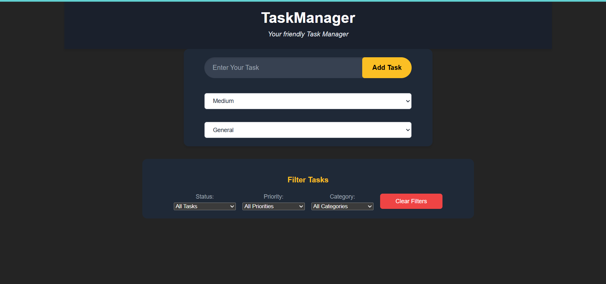
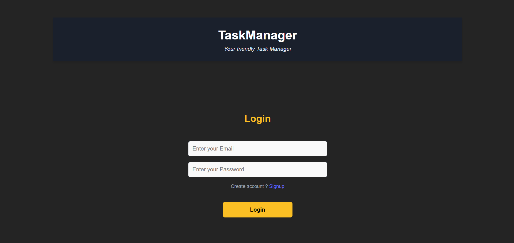
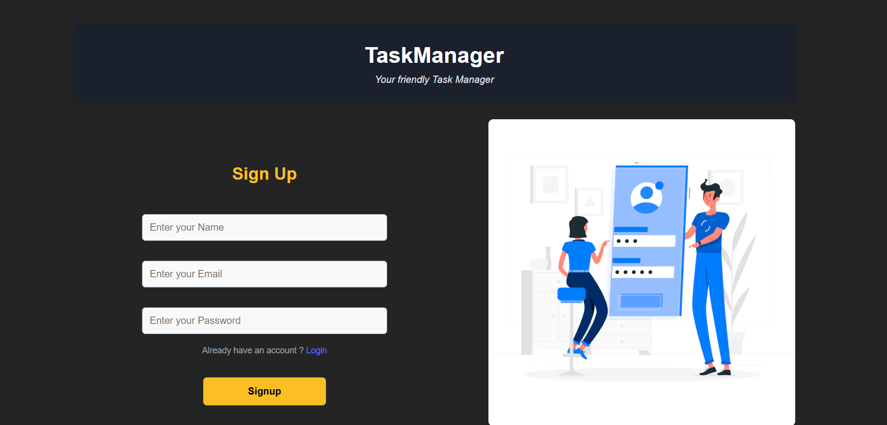

# 🗂️ Personal Task Tracker

## 📋 Description

A sleek and responsive React-based task management application designed for personal productivity. Users can add, update, delete, and filter tasks while tracking their progress visually — all persisted in localStorage.

## ✨ Features

- 🔐 Simple login screen with localStorage support (no authentication)
- 📝 Add task with priority, category, and completion status
- 🔄 Edit and update tasks inline
- 🗑️ Delete tasks with confirmation
- ✅ Mark tasks as completed
- 🔍 Filter tasks (All / Completed / Pending)
- 📅 Display creation date and time
- 🌈 Responsive design for mobile and desktop
- 🎨 Category and priority-based styling
- 💾 Persistent storage using localStorage
- 📊 Visual progress tracker with bar animation

🧪 Technologies Used
- React.js (Hooks + Functional Components)

- React Router for routing

- CSS for styling and responsive layout

- localStorage API for data persistence

🔗 Live Demo
http://task-manager-app-vty.vercel.app

🖼️ Screenshots

